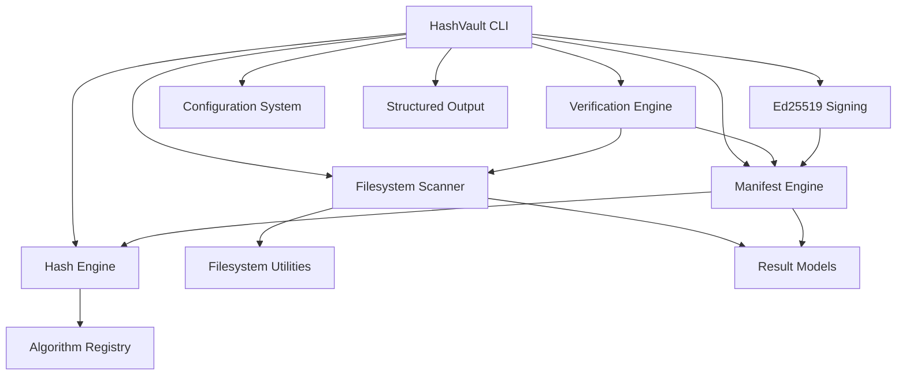

# 🔐 HashVault

> **Cryptographic file integrity verification and tamper detection from the command line.**

[](https://www.python.org/)
[](#-testing)
[](#-testing)
[](#-code-quality)
[](#-code-quality)
[](LICENSE)

---

## 🛡️ What is HashVault?

**HashVault** is a security-focused command-line tool for generating cryptographic hashes, creating integrity manifests, detecting file modifications, and verifying filesystem integrity.

Instead of simply calculating a hash for one file, HashVault provides a complete integrity workflow:

```text
Files / Directory
       │
       ▼
┌─────────────────────┐
│   Hash Generation   │
│     SHA-256         │
└──────────┬──────────┘
           │
           ▼
┌─────────────────────┐
│ Integrity Manifest  │
└──────────┬──────────┘
           │
           ▼
┌─────────────────────┐
│ Filesystem Scanner  │
└──────────┬──────────┘
           │
           ▼
┌─────────────────────────────┐
│ Change Detection            │
│ Modified / Added / Deleted  │
│ Renamed / Unchanged         │
└─────────────┬───────────────┘
              │
              ▼
       INTEGRITY STATUS
````

The project is designed as a **developer/security utility**, with a focus on correctness, deterministic behavior, testability, and secure file handling.

---

# ✨ Features

## 🔑 Cryptographic Hashing

* SHA-256 cryptographic hashing
* Streaming file hashing for large files
* Configurable chunk sizes
* Algorithm registry architecture
* File-level hash generation

Example:

```bash
hashvault hash ./important-file.txt
```

Output:

```text
423f5aaa177b8c2ea31a47a26e301f997473621d7e2eacd72e4cea2186c4e630  ./important-file.txt
```

---

## 📋 Integrity Manifests

Create a cryptographic snapshot of an entire directory.

```bash
hashvault manifest create ./project
```

Example:

```text
Manifest written: ./project/hashvault.manifest.json (42 files, SHA-256)
```

The manifest records the expected cryptographic state of the files so that the directory can be verified later.

---

## 🔍 Tamper Detection

Verify a previously created manifest:

```bash
hashvault manifest verify ./project/hashvault.manifest.json
```

Clean directory:

```text
HASHVAULT INTEGRITY SCAN
────────────────────────────────────────────
(no differences to list)
────────────────────────────────────────────
Modified  : 0
Added     : 0
Deleted   : 0
Renamed   : 0
Unchanged : 42

STATUS: CLEAN — no changes detected
```

After a file is modified:

```text
✗ config.yaml  (modified)

Modified  : 1
Added     : 0
Deleted   : 0
Renamed   : 0
Unchanged : 41

STATUS: CHANGES DETECTED
```

HashVault can distinguish between:

* ✗ Modified files
* * Added files
* − Deleted files
* ↪ Renamed files
* ✓ Unchanged files

---

## 🧭 Directory Change Scanning

HashVault provides filesystem-level change detection rather than simply comparing one hash.

```bash
hashvault scan ./project
```

The scanner analyzes the directory and produces structured change results.

---

## 🔐 Ed25519 Manifest Signing

HashVault supports cryptographic signing of manifests using **Ed25519**.

This allows integrity manifests to be authenticated in addition to simply being hashed.

Key generation:

```bash
hashvault keygen
```

Manifest signing:

```bash
hashvault manifest sign ...
```

Signature verification:

```bash
hashvault manifest verify-signature ...
```

The signing subsystem includes tests for:

* Signature round trips
* Tampered manifests
* Wrong public keys
* Forged key identifiers
* Corrupted signatures
* Truncated signatures
* Invalid key types
* Invalid signature files
* Key file permissions

---

# 🏗️ Architecture



### Core components

| Component          | Responsibility                     |
| ------------------ | ---------------------------------- |
| `algorithms/`      | Cryptographic algorithm registry   |
| `core/hasher.py`   | Streaming file hashing             |
| `core/scanner.py`  | Filesystem change detection        |
| `core/manifest.py` | Manifest creation and verification |
| `core/verifier.py` | Integrity verification             |
| `core/signing.py`  | Ed25519 signing and verification   |
| `models/`          | Structured result models           |
| `config.py`        | Configuration management           |
| `utils/`           | Filesystem and output utilities    |
| `cli.py`           | Command-line interface             |

---

# 🛠️ Technology Stack

| Layer           | Technology                |
| --------------- | ------------------------- |
| Language        | Python 3.12+              |
| Cryptography    | Python `hashlib`, Ed25519 |
| CLI             | Python `argparse`         |
| Testing         | pytest                    |
| Coverage        | pytest-cov                |
| Linting         | Ruff                      |
| Formatting      | Ruff Formatter            |
| Type Checking   | MyPy                      |
| Packaging       | `pyproject.toml`          |
| CI/CD           | GitHub Actions            |
| Version Control | Git                       |

---

# 📁 Repository Structure

```text
HashVault/
│
├── .github/
│   └── workflows/
│       ├── ci.yml
│       └── release.yml
│
├── benchmarks/
│
├── docs/
│   ├── architecture.md
│   └── security.md
│
├── examples/
│
├── src/
│   └── hashvault/
│       ├── algorithms/
│       │   └── registry.py
│       │
│       ├── core/
│       │   ├── hasher.py
│       │   ├── manifest.py
│       │   ├── scanner.py
│       │   ├── signing.py
│       │   └── verifier.py
│       │
│       ├── models/
│       │   └── results.py
│       │
│       ├── utils/
│       │   ├── filesystem.py
│       │   └── output.py
│       │
│       ├── cli.py
│       ├── config.py
│       └── errors.py
│
├── tests/
│   ├── integration/
│   │   ├── test_cli.py
│   │   ├── test_e2e_workflow.py
│   │   └── test_hardening.py
│   │
│   └── unit/
│       ├── test_algorithms.py
│       ├── test_config.py
│       ├── test_filesystem.py
│       ├── test_hasher.py
│       ├── test_manifest.py
│       ├── test_progress.py
│       ├── test_scanner.py
│       ├── test_signing.py
│       └── test_verifier.py
│
├── CHANGELOG.md
├── CONTRIBUTING.md
├── LICENSE
├── README.md
├── SECURITY.md
├── pyproject.toml
└── requirements-dev.txt
```

---

# 🚀 Installation

## Clone the repository

```bash
git clone https://github.com/pashvithareddy-debug/HashVault.git
cd HashVault
```

## Create a virtual environment

```bash
python3 -m venv .venv
source .venv/bin/activate
```

## Install HashVault

```bash
pip install -e .
```

## Install development dependencies

```bash
pip install -e ".[dev]"
```

---

# ⚡ Quick Start

## Generate a file hash

```bash
hashvault hash ./file.txt
```

---

## Create an integrity manifest

```bash
hashvault manifest create ./my-project
```

---

## Verify integrity

```bash
hashvault manifest verify ./my-project/hashvault.manifest.json
```

---

## Scan a directory

```bash
hashvault scan ./my-project
```

---

## Generate signing keys

```bash
hashvault keygen
```

---

# 🖥️ CLI

Run:

```bash
hashvault --help
```

Available commands:

```text
hash       generate cryptographic hash
verify     verify a file against a hash
scan       scan a directory for changes
manifest   create or verify integrity manifests
keygen     generate an Ed25519 signing key pair
config     show the effective configuration
version    show version information
```

Check the installed version:

```bash
hashvault --version
```

Output:

```text
hashvault 3.0.0
```

---

# 🚦 Exit Codes

HashVault provides machine-friendly exit codes:

| Code | Meaning                     |
| ---: | --------------------------- |
|  `0` | Operation successful        |
|  `1` | Integrity mismatch detected |
|  `2` | Usage error                 |
|  `3` | File error                  |
|  `4` | Manifest error              |

This makes HashVault suitable for use in scripts, automation, and CI pipelines.

---

# 🧪 Testing

HashVault includes both unit and integration tests.

Run the complete test suite:

```bash
python -m pytest -q
```

Current test result:

```text
138 passed
```

Run with coverage:

```bash
python -m pytest --cov=hashvault --cov-report=term-missing
```

Current coverage:

```text
Total coverage: 90.84%
Required coverage: 85%
```

The test suite covers:

* Hash generation
* Manifest creation
* Manifest verification
* Filesystem scanning
* CLI workflows
* End-to-end workflows
* Ed25519 signing
* Invalid signatures
* Key handling
* File changes during hashing
* Filesystem hardening
* Configuration behavior
* Error handling

---

# 🧹 Code Quality

HashVault uses multiple automated quality gates.

### Ruff

```bash
ruff check .
```

### Formatting

```bash
ruff format --check .
```

### MyPy

```bash
mypy
```

All three checks are part of the project's development workflow.

---

# 🔒 Security Design

HashVault is designed around several security principles:

### Cryptographic integrity

File contents are represented using cryptographic hashes rather than filenames or timestamps alone.

### Streaming hashing

Files are processed in chunks instead of requiring the entire file to be loaded into memory.

### Secure signing

Ed25519 signatures provide authenticity for signed manifests.

### Input validation

Manifest and filesystem inputs are validated before processing.

### Filesystem hardening

The test suite includes security-focused cases covering filesystem edge cases and changes occurring during hashing.

### Explicit failure states

Integrity mismatches use dedicated exit codes so automated systems can distinguish them from usage and filesystem errors.

For additional security details, see:

* [`SECURITY.md`](SECURITY.md)
* [`docs/security.md`](docs/security.md)

---

# 📊 Engineering Quality

HashVault is intentionally built beyond a single Python script.

| Engineering Area          | Implementation |
| ------------------------- | -------------- |
| Modular architecture      | ✅              |
| Cryptographic hashing     | ✅              |
| Streaming file processing | ✅              |
| Directory scanning        | ✅              |
| Integrity manifests       | ✅              |
| Change classification     | ✅              |
| Ed25519 signatures        | ✅              |
| Structured result models  | ✅              |
| CLI exit codes            | ✅              |
| Configuration system      | ✅              |
| Unit tests                | ✅              |
| Integration tests         | ✅              |
| Security hardening tests  | ✅              |
| Code coverage             | ✅              |
| Static type checking      | ✅              |
| Linting                   | ✅              |
| Automated formatting      | ✅              |
| GitHub Actions            | ✅              |
| Packaging                 | ✅              |
| Documentation             | ✅              |

---

# 🔬 Example Integrity Workflow

```text
                INITIAL STATE

                 project/
                    │
          ┌─────────┼─────────┐
          ▼         ▼         ▼
       app.py    config.yml  data.db
          │         │         │
          └─────────┼─────────┘
                    ▼
             SHA-256 hashes
                    │
                    ▼
          hashvault.manifest.json


                LATER STATE

                 project/
                    │
          ┌─────────┼────────────┐
          ▼         ▼            ▼
       app.py    config.yml   data.db
          │         │
          │         └── MODIFIED
          │
          └──────────────────────┐
                                 ▼
                          HashVault Scanner
                                 │
                                 ▼
                         ┌────────────────┐
                         │ CHANGES FOUND  │
                         │                │
                         │ Modified: 1    │
                         │ Added:    0    │
                         │ Deleted:  0    │
                         │ Renamed:  0    │
                         └────────────────┘
```

---

# 🗺️ Roadmap

### Completed

* [x] Modular Python package
* [x] SHA-256 hashing
* [x] Streaming file hashing
* [x] Algorithm registry
* [x] Directory scanning
* [x] Integrity manifests
* [x] Modified-file detection
* [x] Added-file detection
* [x] Deleted-file detection
* [x] Renamed-file detection
* [x] Structured result models
* [x] JSON output
* [x] Configuration support
* [x] Ed25519 manifest signing
* [x] Security hardening tests
* [x] Unit and integration tests
* [x] GitHub Actions CI
* [x] Packaging
* [x] Documentation

### Future

* [ ] Additional cryptographic algorithms
* [ ] Watch mode for continuous filesystem monitoring
* [ ] Richer machine-readable reporting
* [ ] Performance benchmarking across large datasets
* [ ] Signed release artifacts
* [ ] Extended CI security scanning

---

# 🤝 Contributing

Contributions are welcome.

See [`CONTRIBUTING.md`](CONTRIBUTING.md) for:

* Development setup
* Code style
* Testing requirements
* Pull request workflow
* Contribution guidelines

Before submitting a change:

```bash
ruff check .
ruff format --check .
mypy
python -m pytest -q
```

---

# 📄 License

HashVault is distributed under the MIT License.

See [`LICENSE`](LICENSE) for details.

---

# 👩‍💻 Author

### Ashvitha Reddy

Computer Science Engineering student interested in:

* Software Engineering
* Cybersecurity
* Artificial Intelligence & Machine Learning
* Backend Development
* Developer Tooling

---

⭐ **If you find HashVault useful, consider giving the repository a star.**
